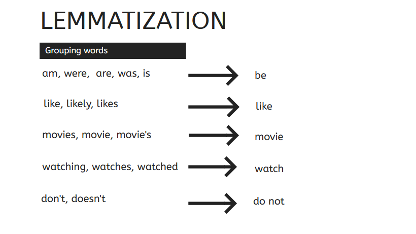
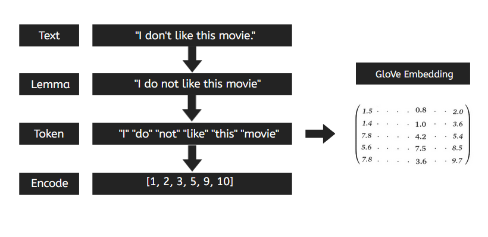

# Natural Language Processing - IMDb Reviews classification.

This is a project about natural language processing for classify reviews.

The objective of this project is create a supervised learning model that categorize reviews into positive or negative.

## Dataset

The dataset is a list of 50.000 IMDb reviews from https://www.kaggle.com/lakshmi25npathi/imdb-dataset-of-50k-movie-reviews.

Each review is classified by positive or negative. There are 25.000 positives and 25.000 negatives.
I divide the dataset into a training and test set, using the training set for training the model and the test set for evaluate how good it does.

## Cleaning

In first place I remove all puntuaction and we made the lemmatization of the text.

Lemmatization is the process of grouping together the inflected forms of a word, reducing the number of different words in the text, withoug losing the context.

## Processing

The second part is processing the texts. We tokenize each word and encode them with a unique number.

## Model

The model is a TextCNN, the first layer is a embedding layer using glove, three convolutional layers in parallel, applying a maxpooling for each one, concatenating them and the last sigmoid layer. The output is a number between 0 and 1, 0 is for negative and 1 is for positive.

### The convolutional layer

Each word has a vector representation from the Glove embedding, for each phrase we obtain a vector that tell us how important the word are in the sentence.

## Results

I used the test set for evaluating the model, It is a set of 2500 reviews that the model didn't see before.

The model has an accuracy of 92%.

From the 2500 reviews it classified well 2303.

## IMDb API

I made a program for check reviews of movies from IMDb using an API.
You can look for a movie, see how many reviews it has and check if they are positives or negatives using the model.

